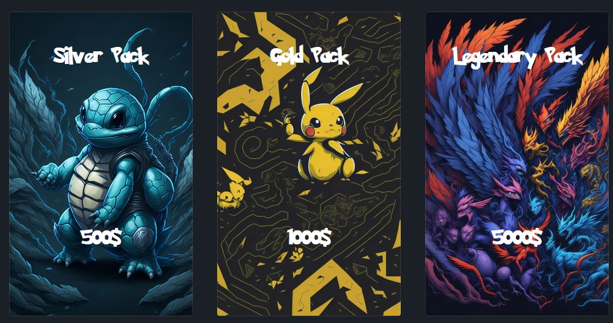

  <h3 align="center">PokeStudio - For Pokemon's Community!</h3>
  

    
    
    
  

## 📋 <a name="table">Table of Contents</a>

1. 📎 [Introduction](#introduction)
2. ⚙️ [Tech Stack](#tech-stack)
3. 💻 [First Look](#first-look)
4. 😎 [About Me](#about-me)

## <a name="introduction">📎 Introduction</a>

The PokéStudio is not just an ordinary Pokedex app you've seen multiple times.
It goes beyond that, allowing users to browse their favorite Pokémon, access
detailed information, and more. Upon registration, users gain access to their
personal Pokédex, a storage for unique Pokémon cards obtained from packs. These
cards play a crucial role in battling against an AI opponent, earning coins to
purchase additional packs. You can also enjoy the PokeStudio community and share
some posts from pokemon world!

## <a name="tech-stack">⚙️ Tech Stack</a>

- React
- Typescript
- Poke-api
- Firebase
- css-modules

## <a name="first-look">💻 First Look</a>

✨ Welcome to Service!

## Browse your favorite Pokemon from a database of over 800 Pokemon.

## Get detailed information about a given Pokemon

## Register/login to get acces to personal pokedex

Test credentials:
email: user@wp.pl
password: 123456

## Enjoy PokeStudio community

You can read other users' posts or share your own pokemon story with others.

## Open packs -> get pokemons!

The user receives 2000 coins at the start that will allow you to open packages
to collect Pokemon to fight. 

## Manage your collection

Add the Pokemon obtained from the packs to your shelf.

## Fight on arena

Fight against the AI and play for prizes. In the event of a defeat, the user loses some of their pokemons that they put into battle.

## <a name="about-me">😎 About Me</a>

Hello this app was created by me! Enjoy. If you have any question, feel free to
create new issue ticket. Otherwise you can contact me via my socials or email:

- 📱 <a href="https://www.linkedin.com/in/emil-szymczyk-209613209/">linkedin</a>
- 📧 email: emil-szymczyk2@wp.pl

Enjoy PokeStudio!

Enjoy!
